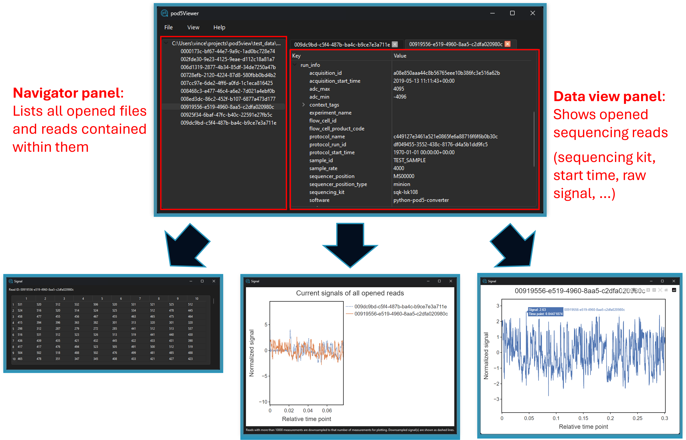
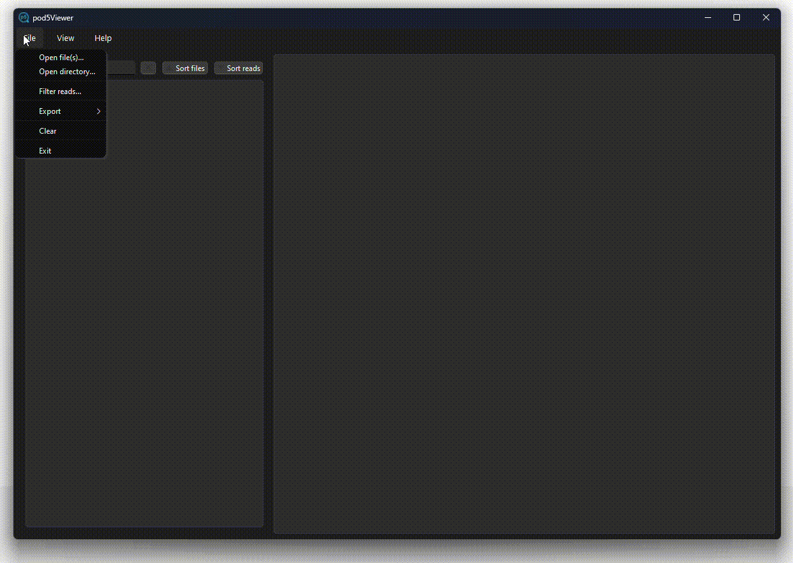
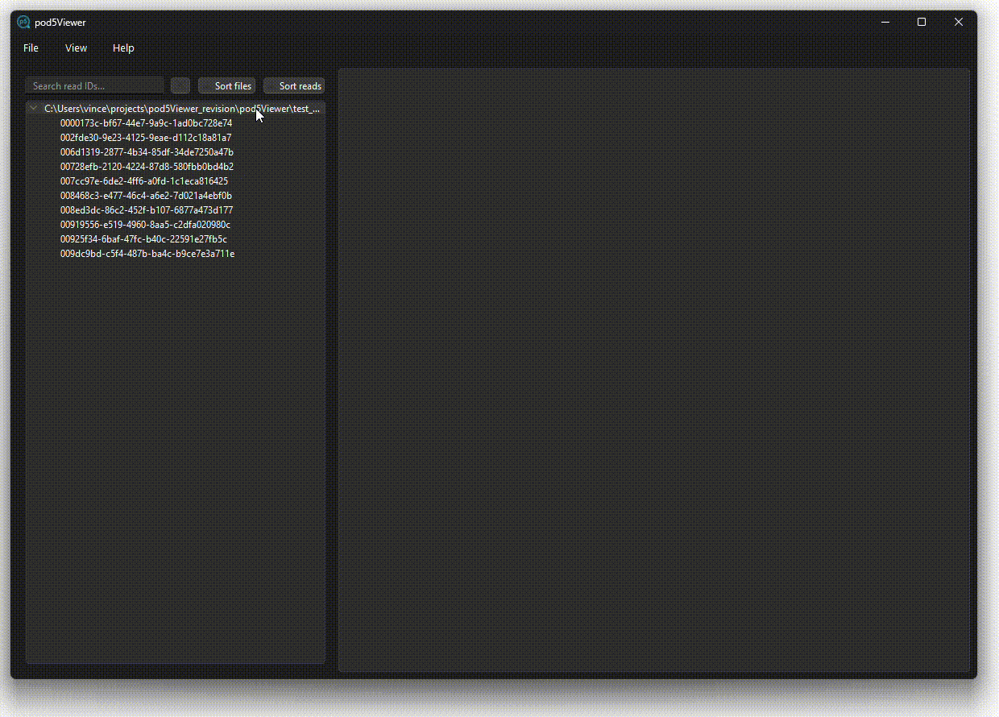
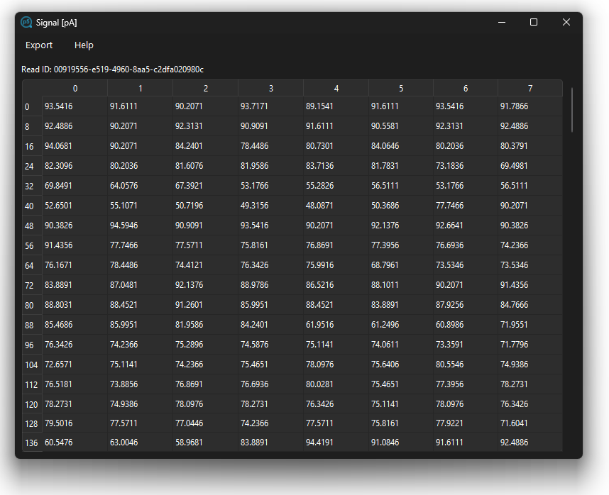
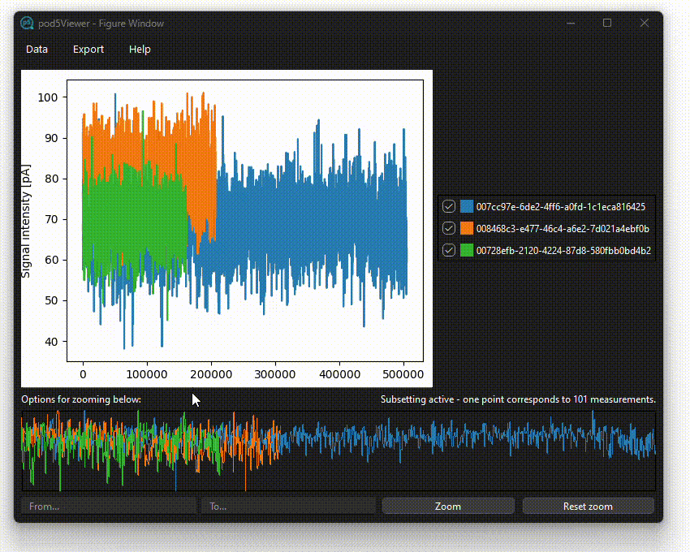

The pod5Viewer is a Python application that provides a graphical user interface for viewing and navigating through POD5 files. It allows users to open multiple POD5 files, explore their contents, and display detailed data for selected read IDs.

[](http://www.gnu.org/licenses/gpl-3.0) [](CODE_OF_CONDUCT.md)   

## Table of Contents

- [Table of Contents](#table-of-contents)
- [Installation and requirements](#installation-and-requirements)
  - [Windows](#windows)
  - [Linux](#linux)
  - [OS-independent](#os-independent)
  - [Dependencies](#dependencies)
- [Usage](#usage)
  - [Open and inspecting pod5 files](#open-and-inspecting-pod5-files)
  - [Filtering for specific reads](#filtering-for-specific-reads)
  - [Viewing signals](#viewing-signals)
  - [Plotting signals](#plotting-signals)
  - [Exporting reads](#exporting-reads)
  - [Shortcuts](#shortcuts)
- [License](#license)

## Installation and requirements

### Windows

For Windows systems the pod5Viewer can be installed conveniently via the installer. The installer can be downloaded here:

[pod5Viewer-1.1.1-Setup.exe](https://github.com/dietvin/pod5Viewer/releases/download/1.1.1/pod5Viewer-1.1.1-Setup.exe "Download pod5Viewer Windows installer") 

After downloading the installer and following the steps provided, the pod5Viewer can be accessed and opened from the start menu or the desktop shortcut. It also sets the pod5Viewer as the standard application to open POD5 files, so it is possible to open a file by simply clicking on it.

**Note**: When running the installer a the Windows defender might open the Window `Windows protected your PC`. To continue the installation, press `More Info` and `Run anyway`.

### Linux

DEB files are available for Ubuntu 22.04 & 24.04 and Linux Mint 20.3 & 21.3 at the following links:

- [Ubuntu 22.04](https://github.com/dietvin/pod5Viewer/releases/download/1.1.1/pod5viewer_1.1.1_ubuntu_22.04.deb "Download pod5Viewer for Ubuntu 22.04")
- [Ubuntu 24.04](https://github.com/dietvin/pod5Viewer/releases/download/1.1.1/pod5viewer_1.1.1_ubuntu_24.04.deb "Download pod5Viewer for Ubuntu 24.04")
- [Linux Mint 21.3](https://github.com/dietvin/pod5Viewer/releases/download/1.1.1/pod5viewer_1.1.1_linuxmint_21.3.deb "Download pod5Viewer for Linux Mint 21.3")
- [Linux Mint 20.3](https://github.com/dietvin/pod5Viewer/releases/download/1.1.1/pod5viewer_1.1.1_linuxmint_20.3.deb "Download pod5Viewer for Linux Mint 20.3")

After downloading use apt to install it on the system:

```bash
sudo apt install ./pod5viewer_<VERSION>_<SYSTEM>.deb
```

Like the Windows installation, the pod5Viewer can then be opened like any other installed application.

### OS-independent

The pod5Viewer can be installed via the Python packaging index using `pip`.

Note that when installing the pod5Viewer via pip, it can only be started from the command line. It is not possible to open POD5 files directly from a file browser.

Here we recommend installing the pod5Viewer into a fresh virtual environment via [Conda](https://docs.anaconda.com/miniconda/) or a similar environment manager:

```bash
conda create -n p5v python==3.11 
conda activate p5v
```

With the virtual environment active, the pod5Viewer can be installed via pip:

```bash
pip install pod5Viewer
```

To start the pod5Viewer from a python environment type:

```bash
pod5Viewer
```

Optionally specify one or more path(s) to POD5 file(s) to open these directly:

```bash
pod5Viewer file1.pod5 file2.pod5
```

---

Alternatively, the pod5Viewer can be installed from source:

```bash
git clone https://github.com/dietvin/pod5Viewer.git
cd pod5Viewer
pip install .
```

### Dependencies

The pod5Viewer is built in Python (v3.11.0) and relies on the following packages:

- pod5 (v0.3.10)
- pyside6 (v6.5.2)
- matplotlib (v3.9.2)

The compliation for Windows was performed using the pyinstaller (v6.8.0) and the Windows installer was created using the Inno Setup Compiler (v6.3.1).

## Usage



### Open and inspecting pod5 files

In the pod5Viewer open files from the menu bar in the top via `File > Open file(s)...` (individual file(s)) or `File > Open directory` (all files in a directory). All opened files are shown in the left panel. Expanding an entry shows all reads in a given file by their read ID. Opened files and reads can be sorted alphabetically in ascending or descending order using the respective buttons above the panel. Specific read IDs can be searched using the search bar. Typing a search query updates the panel to show fitting reads in real-time. The button next to the search bar clears a given search query. 

A single click on a read ID opens the entry as a preview (i.e. it gets overwritten once another entry is selected). A double click opens it permanently, so multiple reads can be opened at the same time. Tabs can be closed via the `X` symbol. A tab shows all attributes stored in a pod5 file as key-value pairs. Nested information can be expanded. Values can be selected via double-click and copied to the clipboard.

Opened files and reads can be cleared from the window through `File > Clear`. To exit the app use  `File > Exit`.



### Filtering for specific reads

To enable the user to focus on a specific subset of reads in given POD5 files, reads can be filtered to a subset. To activate this feature navigate to `File > Filter reads...`. This opens a new window containing a text browser, in which read IDs can be inserted. Here one read ID must be given per line. Alternatively, read IDs can be loaded from a text file, again containing one read ID per line. Press the `Load IDs from file...` button to select a file for filtering. After loading, the contents of the file are shown in the text browser. Press `Done` to submit given read IDs for filtering. Afterwards, only reads that are found in the given set are shown. 

To clear the subset, reopen the window, press `Clear` and `Done`. Afterwards all read IDs are shown again.




### Viewing signals

Individual current measurement can be inspected via `View > View signal`. This shows the current values in chunks. Use the scroll bar to scroll through chunks. 




### Plotting signals

To plot the current measurements select `View > Plot signal...`, `View > Plot pA signal...`. Signals can be plotted for a single read (`Focussed read...`) or all opened reads (`All open reads...`). When selecting a option, a new window open showing the selected data as a line plot. The window contains the figure itself in the upper-left section, the legend containing each shown read ID in the upper-right section and a navigation section in the lower part of the window. 

The navigation section shows a rough map of the whole figure and allows for selection of specific intervals. The user can select an interval by pressing on the start coordinate in the navigation map and dragging the cursor to the wanted end coordinate. When releasing the mouse button, the figure gets updated to show the new interval. For more fine-tuned zooming, two input fields are given below the map. In these the user can type a start and end value and press `Zoom` to focus on the provided interval specifically. Zooming can be resetted via the `Reset zoom` button. This restores the plot to the initial state.

When multiple signals are shown, individual ones can be hidden/shown by unchecking/checking the corresponding checkbox in the legend.

To switch to plotting the normalized signals select `Data > Show normalized data` in the menu. To revert back to the non-normalized signals, press `Data > Show data`.

The current view can be exported to a vector graphic (SVG) by pressing `Export > Export current view...`. This opens a file browser where an export path can be selected.

For faster performance and responsiveness of the window, long signals are subset to a maximum of 10000 measurements per signal at any given point. When subsetting, the data is split into 10000 bins, for each of which the median value is calculated. The label above the navigation section indicates whether subsetting is performed in the section that is currently shown, and if so how many measurements are contained in one bin. This way, the resolution of the shown data increases dynamically with higher zoom levels, providing the best performance with the least amount of information loss.




### Exporting reads

Either all opened reads (`All opened reads...`) or only the currently focused one (`Current read...`) can be exported to JSON format using `File > Export all info`. When exporting, the user selects an output file or directory in the file browser, where a JSON file is created for each exported read with the read-id as the file name.

The measurements of a read can be exported isolated from the remaining data of a given read through the `Export signal` menu. The values can be exported to a `.npy` Numpy file for further processing in a `Numpy` environment. Alternatively, they can be written to a text file, where each line contains one measurement.

### Shortcuts

Various keyboard shortcuts are available, allowing for all actions to be performed without a mouse. The following shortcuts are implemented:

- Ctrl+O: Open file(s)
- Ctrl+D: Open directory
- Ctrl+S: Export current read
- Ctrl+A: Export all opened reads
- Ctrl+Backspace: Clear viewer
- Ctrl+Q: Exit application

Navigation:

- Tab: Switch between file navigator and data viewer
- Ctrl+Tab: Cycle through tabs in the data viewer
- Ctrl+W: Close the current tab in the data viewer

Menu navigation:

- Alt & F: Open the file menu
- Alt & V: Open the view menu
- Alt & H: Open the help menu

View signal window:

- Pagedown: Scroll down (large steps)
- Pageup: Scroll up (large steps)
- Arrow down: Scroll down
- Arrow up: Scroll up

## License

This project is licensed under the GPL3.0 License. See the [LICENSE](./LICENSE) file for details.
