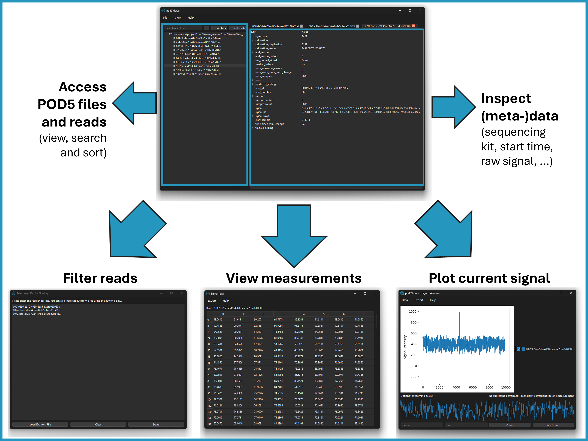

The pod5Viewer is a Python application that provides a graphical user interface for viewing and navigating through POD5 files. It allows users to open multiple POD5 files, explore their contents, and display detailed data for selected read IDs.

[](http://www.gnu.org/licenses/gpl-3.0) [](CODE_OF_CONDUCT.md)   

## Table of Contents

- [Table of Contents](#table-of-contents)
- [Installation and requirements](#installation-and-requirements)
  - [Windows](#windows)
  - [Linux](#linux)
  - [OS-independent](#os-independent)
  - [Dependencies](#dependencies)
- [Usage](#usage)
  - [Open and inspecting pod5 files](#open-and-inspecting-pod5-files)
  - [Viewing signals](#viewing-signals)
  - [Plotting signals](#plotting-signals)
  - [Exporting reads](#exporting-reads)
  - [Shortcuts](#shortcuts)
- [Limitations](#limitations)
  - [Plotting large amounts of data](#plotting-large-amounts-of-data)
- [License](#license)

## Installation and requirements

### Windows

For Windows systems the pod5Viewer can be installed conveniently via the installer. The installer can be downloaded here:

[pod5Viewer-1.0.3-Setup.exe](https://github.com/dietvin/pod5Viewer/releases/download/1.0.3/pod5Viewer-1.0.3-Setup.exe "Download pod5Viewer Windows installer") 

After downloading the installer and following the steps provided, the pod5Viewer can be accessed and opened from the start menu or the desktop shortcut. It also sets the pod5Viewer as the standard application to open POD5 files, so it is possible to open a file by simply clicking on it.

**Note**: When running the installer a the Windows defender might open the Window `Windows protected your PC`. To continue the installation, press `More Info` and `Run anyway`.

### Linux

DEB files are available for Ubuntu 22.04 & 24.04 and Linux Mint 20.3 & 21.3 at the following links:

- [Ubuntu 22.04](https://github.com/dietvin/pod5Viewer/releases/download/1.0.3/pod5viewer_1.0.3_ubuntu22.04.deb "Download pod5Viewer for Ubuntu 22.04")
- [Ubuntu 24.04](https://github.com/dietvin/pod5Viewer/releases/download/1.0.3/pod5viewer_1.0.3_ubuntu24.04.deb "Download pod5Viewer for Ubuntu 24.04")
- [Linux Mint 21.3](https://github.com/dietvin/pod5Viewer/releases/download/1.0.3/pod5viewer_1.0.3_linuxmint21.3.deb "Download pod5Viewer for Linux Mint 21.3")
- [Linux Mint 20.3](https://github.com/dietvin/pod5Viewer/releases/download/1.0.3/pod5viewer_1.0.3_linuxmint20.3.deb "Download pod5Viewer for Linux Mint 20.3")

After downloading use apt to install it on the system:

```bash
sudo apt install ./pod5viewer_1.0.2_<SYSTEM>.deb
```

Like the Windows installation, the pod5Viewer can then be opened like any other installed application.

### OS-independent

The pod5Viewer can be installed via the Python packaging index using `pip`.

Note that when installing the pod5Viewer via pip, it can only be started from the command line. It is not possible to open POD5 files directly from a file browser.

Here we recommend installing the pod5Viewer into a fresh virtual environment via [Conda](https://docs.anaconda.com/miniconda/) or a similar environment manager:

```bash
conda create -n p5v python==3.11 
conda activate p5v
```

With the virtual environment active, the pod5Viewer can be installed via pip:

```bash
pip install pod5Viewer
```

To start the pod5Viewer from a python environment type:

```bash
pod5Viewer
```

Optionally specify one or more path(s) to POD5 file(s) to open these directly:

```bash
pod5Viewer file1.pod5 file2.pod5
```

---

Alternatively, the pod5Viewer can be installed from source:

```bash
git clone https://github.com/dietvin/pod5Viewer.git
cd pod5Viewer
pip install .
```

### Dependencies

The pod5Viewer is built in Python (v3.11.0) and relies on the following packages:

- pod5 (v0.3.10)
- pyside6 (v6.5.2)
- plotly (v5.22.0)
- pyyaml (v6.0.1)

The compliation for Windows was performed using the pyinstaller (v6.8.0) and the Windows installer was created using the Inno Setup Compiler (v6.3.1).

## Usage



### Open and inspecting pod5 files

In the pod5Viewer open files from the menu bar in the top via `File > Open file(s)...` (individual file(s)) or `File > Open directory` (all files in a directory). All opened files are shown in the left panel. Expanding an entry shows all reads in a given file by their read ID.

A single click on a read ID opens the entry as a preview (i.e. it gets overwritten once another entry is selected). A double click opens it permanently, so multiple reads can be opened at the same time. Tabs can be closed via the `X` symbol. A tab shows all attributes stored in a pod5 file as key-value pairs. Nested information can be expanded. Values can be selected via double-click and copied to the clipboard.

Opened files and reads can be cleared from the window through `File > Clear`. To exit the app use  `File > Exit`.

### Viewing signals

Individual current measurement can be inspected via `View > View signal...`. This shows the current values in chunks of 100. Use the scroll bar to scroll through chunks.

### Plotting signals

To plot the current measurements select `View > Plot signal...`, `View > Plot pA signal...` or `View > Plot normalized signal...`. Signals can be plotted for a single read (`Focussed read...`) or all opened reads (`All open reads...`). The plots are interactive and allow for zooming, panning, hiding specific reads, and exporting. Downsampling is used for long signals for better performance.

### Exporting reads

Either all opened reads (`Export all opened reads...`) or only the currently focused one (`Export current read...`) can be exported to YAML format using via  `File > Export`. When exporting, the user selects an output directory in the file browser, in which a YAML file is created for each exported read with the read-id as the file name.

### Shortcuts

Various keyboard shortcuts are available, allowing for all actions to be performed without a mouse. The following shortcuts are implemented:

- Ctrl+O: Open file(s)
- Ctrl+D: Open directory
- Ctrl+S: Export current read
- Ctrl+A: Export all opened reads
- Ctrl+Backspace: Clear viewer
- Ctrl+Q: Exit application

Navigation:

- Tab: Switch between file navigator and data viewer
- Ctrl+Tab: Cycle through tabs in the data viewer
- Ctrl+W: Close the current tab in the data viewer

Menu navigation:

- Alt & F: Open the file menu
- Alt & V: Open the view menu
- Alt & H: Open the help menu

View signal window:

- Pagedown: Scroll down (large steps)
- Pageup: Scroll up (large steps)
- Arrow down: Scroll down
- Arrow up: Scroll up

## Limitations

### Plotting large amounts of data

When plotting many reads at a time the figure can become too large for displaying it in the plot window and it may show a white screen only. This is due to limitations of the plotly framework. The limit for this is around 40000 measurements in one plot, if this number is exceeded a warning pops up when opening the plot window.
If a plot does not show, it is recommended to plot fewer reads at a time.

## License

This project is licensed under the MIT License. See the [LICENSE](./LICENSE) file for details.
